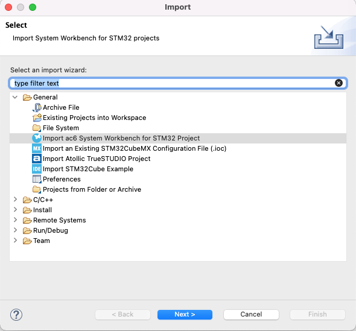

# UWB Sniffer 

This project contains the code needed to create a UWB Sniffer using the Qorvo DW3000 chips. 

## Hardware 
Our implementation is based on a [DWM3000EVB](https://www.decawave.com/product/dwm3000evb/) and a NUCLEO-F429ZI. Different boards, such as a nRF52840, can be used as well, but some code needs to be adapted. 

## Compilation 
The following tools are required to compile the project: 

1. The STM32CubeIDE 
2. The sample code from the [Decawave website](https://www.decawave.com/wp-content/uploads/2022/03/DW3xxx_XR6.0C_24Feb2022.zip) (We cannot upload it here due to license issues)

### Import the project 
#### Building the examples 
1. Open a new workspace in the STM32CubeIDE
2. Go to File->Import->General->Import ac6 System Workbench for STM32 Project
3. Select the root folder of the sample project and import the project 
4. Accept to convert the project to the new format 
5. Now you can build and run the examples 
6. Make sure that the examples build without an error 

*Hint:* Two errors will be shown, but they do not indicate an issue: 
```log
arm-none-eabi-size: DW3000_API_CubeMX.bin: file format not recognized
make[1]: *** [makefile:140: post-build] Error 3
make: *** [makefile:107: all] Error 2
```



### Integrate the sniffer code 
1. Copy all source files from this project to the root folder of the DWM3000 sample code 
2. Overwrite the main.c with the one in this project 
3. Compile the project 
4. Run it on an NUCLEO-F429ZI 

## Configure the sniffer 
UWB has a variety of available configurations: channel, preamble code, data rate, sts mode, and sts length. 
Most of them have to be known in advance to sniff a communication. In most cases these values can be identified through means of reverse-engineering. For iOS UWB communication, we use the iOS system logs from the nearbyd to identify those values. 
The values can be changed in the `uwb_sniffer.c`file in the `config` struct. 

In the current implementation the sniffer also transfers frames with incorrect headers or frame lengths to the host. So make sure to check the Wireshark output if it is correct. An incorrect configuration leads to long and incorrect frames where the STS or pars of the preamble will be interpreted as data. 

## Receiving frames in Wireshark 
We adopted our sniffer to support the sensniff commands and added commands for sending more information like the reception timestamp. 
More information about [sensiff is available here](https://github.com/g-oikonomou/sensniff).
This leads to timestamps with the same accuracy as the DWM3000 has (15.65ps). 

To receive frames, we recommend using the `sensniff.py` script and running iot with this command
```
python3 sensniff.py -DINFO 
```

The script will automatically find the attached device. If you run multiple sniffer, you can forward the device serial port to sensniff. 
```
python3 sensniff.py -DINFO -d /dev/cu.usbmodem230d 
```

All available commands can be viewed in the sensniff readme. 


To receive the frames in Wireshark, you need to add the pipe as a new interface. 
Follow these steps: 

1. Open Wireshark
2. Open "Capture options"
3. Click on "Manage Interfaces..." 
4. Select Pipes 
5. Add a new pipe with the path `/tmp/sensniff`
6. Now start observing the pipe in Wireshark. 

